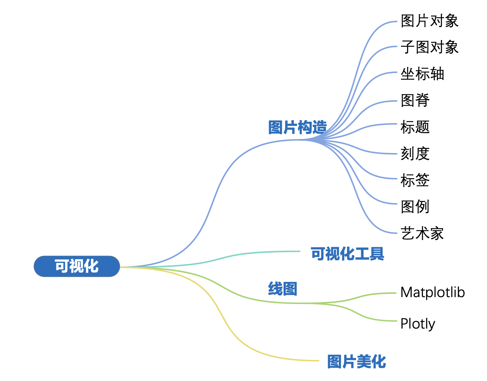
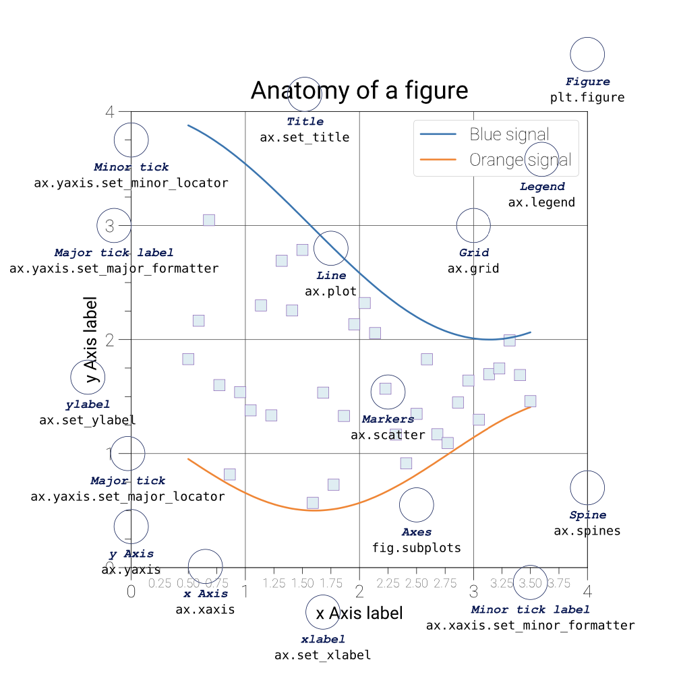

# Fundamentals of Visualization




- figure
- axes
- axis
- spine
- title
- tick
- label
- legend
- artist

## Tools

- `Matplotlib`: 可能是 Python 中最常用的绘图库，Matplotlib 具有丰富的绘图功能和灵活的使 用方式。Matplotlib 可以绘制多种类型的图形，包括折线图、散点图、柱状图、饼图、等高线图等各 种二维、三维图像，还可以进行图像处理和动画制作等。
- `Seaborn`: 是基于 Matplotlib 的高级绘图库，专注于统计数据可视化。它提供了多种高级数据可 视化技术，包括分类散点图、热图 (热力图)、箱线图、分布图等，可以快速生成高质量的统计图表。 Seaborn 适用于数据分析、数据挖掘和机器学习等领域。
- `Plotly`: 是一个交互式可视化库，可以生成高质量的静态和动态图表。它提供了丰富的图形类型和 交互式控件，可以通过滑块、下拉列表、按钮等方式动态控制图形的显示内容和样式。Plotly 适用于 Web 应用、数据仪表盘和数据科学教育等领域。

## Matplotlib

```python
numpy.linspace(start, stip, num=50, endpoint=True)
```
