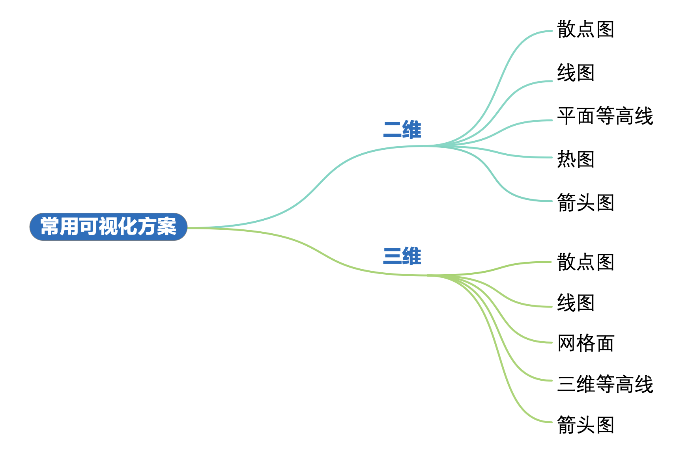

# 2D and 3D Visualizations



## 2D Visualizations

- scatter plot
  ```python
  matplotlib.pyplot.scatter()
  seaborn.scatterplot()
  plotly.express.scatter()
  plotly.graph_objects.Scatter()
  ```
- line plot
- contour plot
  ```python
  matplotlib.pyplot.contour(X, Y, Z, levels, cmap)
  numpy.meshgrid()
  plotly.graph_objects.Contour()
  ```
- heatmap
  ```python
  matplotlib.pyplot.imshow()
  seaborn.heatmap(data, vmin, vmax, cmap, annot)
  ```

## 3D Visualizations

3D visualization schemes:

- scatter plot
- line plot
- mesh surface plot
- 3D contour plot

3D view perspective:

- top view
- side view
- front view
- isometric view

```python
fig, ax = matplotlib.pyplot.subplots()
ax.view_init(elev, azim, roll)
```

- elevation: the angle between the observer and the xy plane
- azimuth: the angle at which the observer rotates about the z-axis
- roll: the angle of rotation in the direction of the observer's line of sight

```python
fig = matplotlib.pyplot.figure()
ax = fig.add_subplot(projection='3d')
ax.set_proj_type()
```

- perspective projection
- orthographic projection
