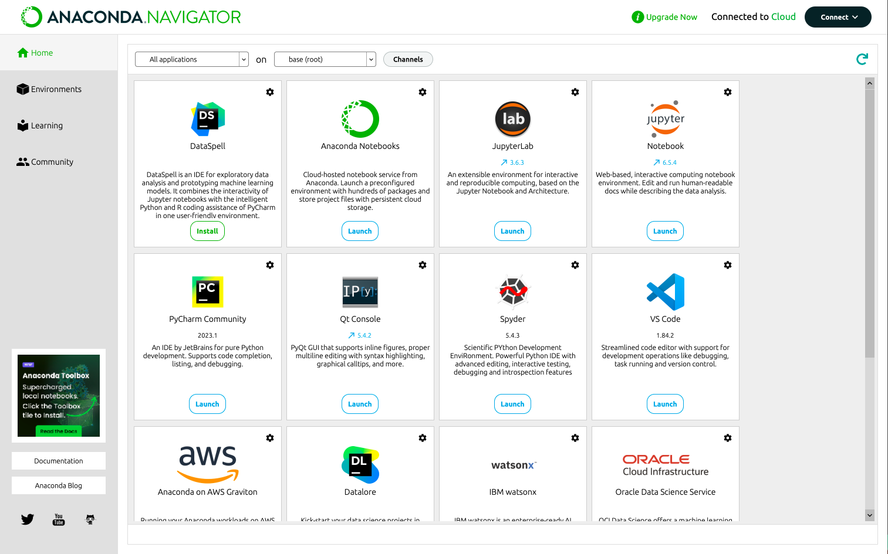
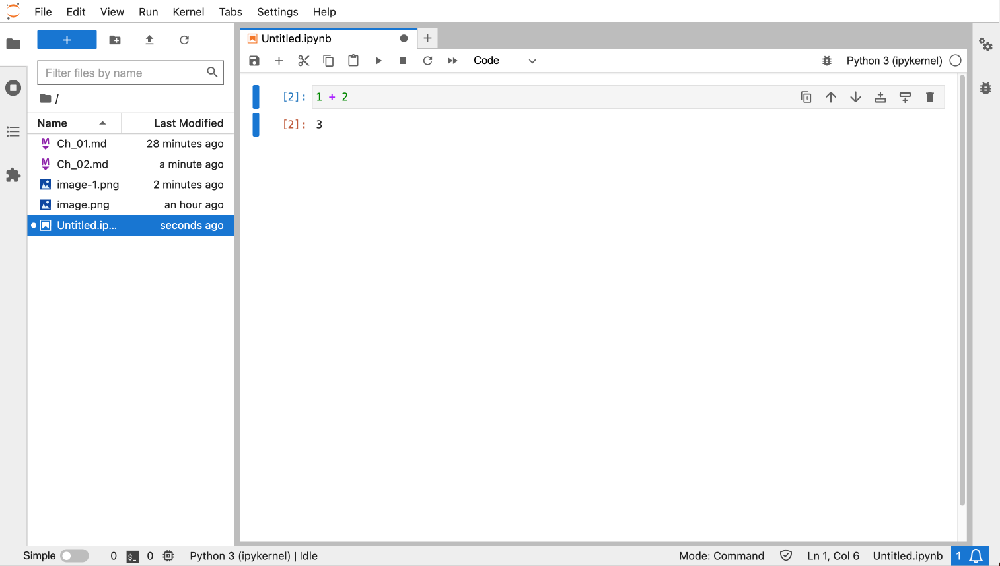

# Anaconda

## IDE

- JupyterLab ✅

- Spyder

- PyCharm ✅

## Installation

For Mac:
https://docs.anaconda.com/anaconda/install/mac-os/

## HW

- Install Anaconda ✅

- Jupyter Lab

  - Anaconda: JupyterLab Launch

  - Shell: jupyter lab
    
