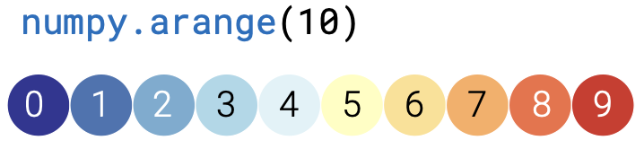
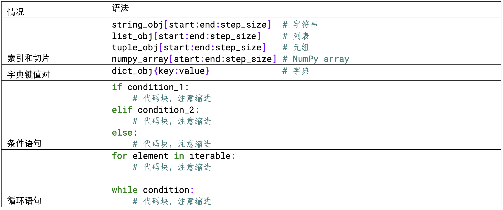
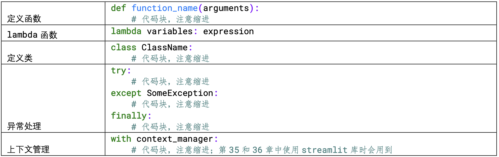
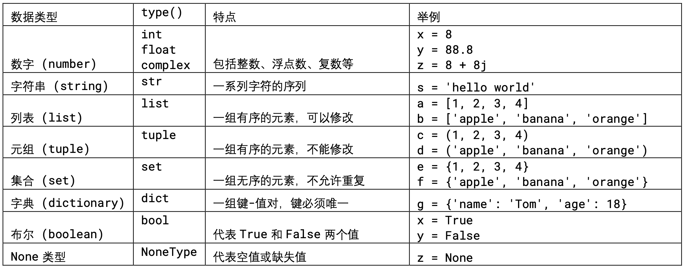
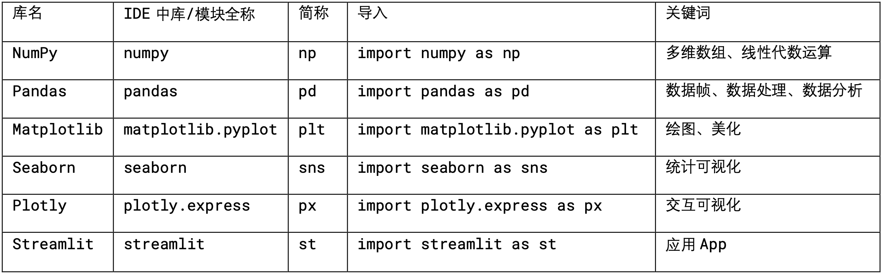
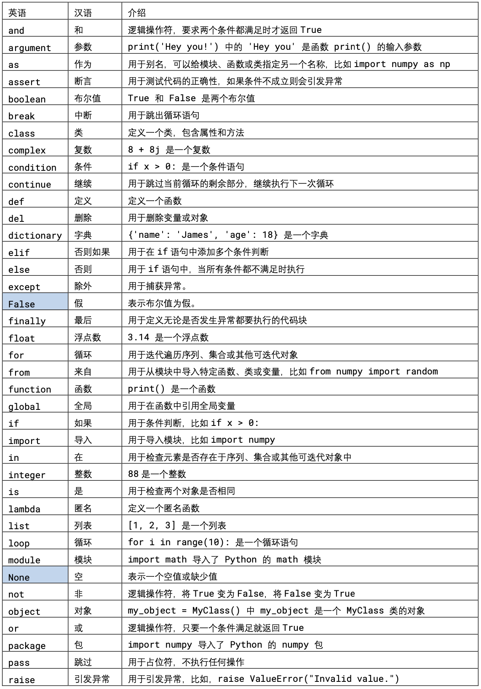
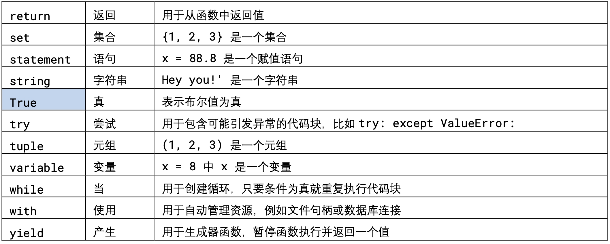

# Fundamentals of Grammar in Python

## Comments

```python
# import numpy and rename it as np
import numpy as np

# use numpy.arrage to create an array
x_array = np.arange(10) # x_array has 10 integers from 0 to 9
```



Shortcuts: `ctrl + /`

```python
def my_function(x, y):
    '''
    This function computes the sum of two numbers x, y
    The input is:
        x: The first number to be added.
        y: The second number to be added.
    '''
    """
    The output is:
        The sum of x and y.
    """
    return x + y

pring(my_function(1.5, 2))
```

**Cases using colon**



## Indentation

4 spaces

## Variables



## Import Libraries

- `Matplotlib` 是 Python 中最流行的绘图库之一，可用于创建各种类型的静态图形，如线图、散 点图、柱状图、等高线图等。
- `Seaborn` 是基于 Matplotlib 的高级绘图库，提供了更美观、更丰富的图形元素和绘图样式。

- `Plotly` 是一款交互式绘图库，可用于创建各种类型的交互式图形，如散点图、热力图、面积图、气泡图等，支持数据可视化的各个方面，包括统计学可视化、科学可视化、金融可视化等。

- `NumPy` 是 Python 中常用的数值计算库，提供了数组对象和各种数学函数，用于高效地进行数值计算和科学计算。

- `Pandas` 是 Python 中常用的数据处理库，提供了高效的数据结构和数据分析工具，可用于数据清洗、数据处理和数据可视化。

- `Scikit-learn` 是 Python 中常用的机器学习库，提供了各种常见的机器学习算法和模型，包括 分类、回归、聚类、降维等。

- `TensorFlow` 是谷歌开发的机器学习框架，提供了各种深度学习模型和算法，可用于构建神经网 络、卷积神经网络、循环神经网络等深度学习模型。

- `Streamlit` 可以通过简单的 Python 脚本快速构建交互式数据分析、机器学习应用程序。

```python 
import numpy
a = numpy.array([1, 2, 3])

import numpy as np
a = np.array([1, 2, 3])

from numpy import array
a = array([1, 2, 3])

from numpy import *
a = array([1, 2, 3])
b = random.ran(3, 3)
```



**key words**



