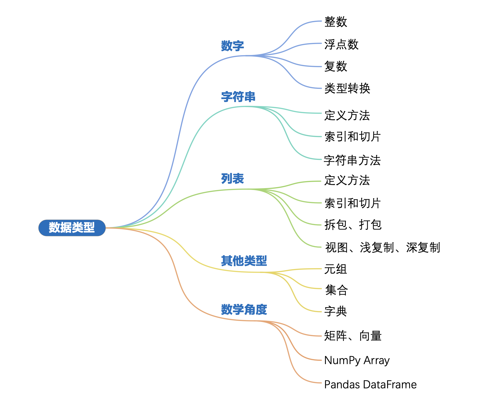
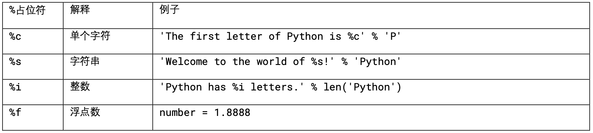
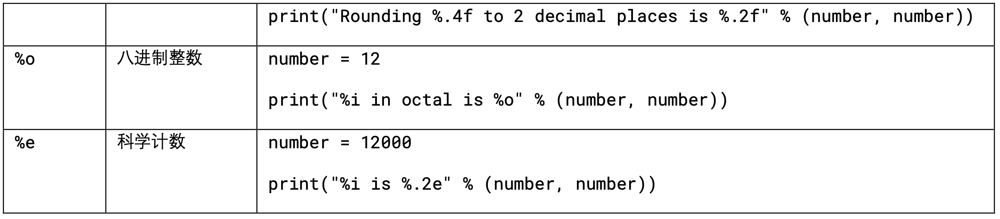
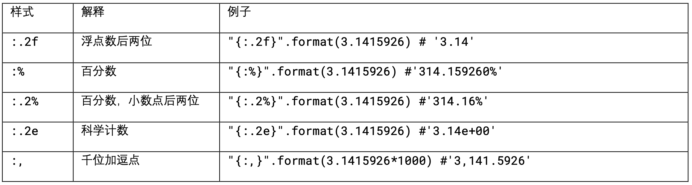
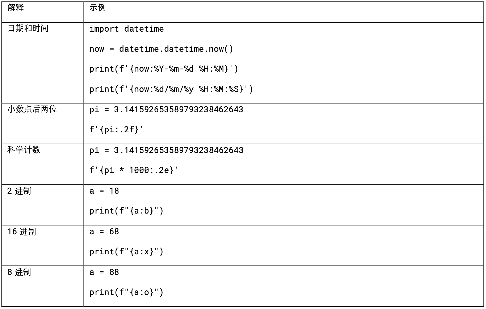

# Data Types in Python

## Data Types

- number
- string
- list
- tuple
- set
- dictionary:
- Boolean: `True` `False`
- None

Advanced: `Generator`、`Iterator`、`Function`、`Class`

## Number: Int, Float, Complex

- `int(x)`: transfer `x` to `int` type
- `float(x)`: transfer `x` to `float` type
- `complex(x)`: transfer `x` to `complex` type
- `str(x)`: transfer `x` to `string` type

## String

- `indexing` & `slicing`
- `len()`
- `print()`
- `enumerate()`
- formatted string / f-strings
- `lower()` & `upper()`
- `capitalize()`
- `count()`
- `find()`
- `isalnum()`
- `isdigit()`
- `join()`
- `replace()`
- `split()`

**insert data in string**

- `+`
- `%` placeholder
- `str.format()`
- f-strings
  
  
  
  

## List

- `insert()`
- `append()`
- `del`
- `remove()`
- `in`
- `reverse()`
- `join()`
- unpacking `*`
- `view` vs `copy()` vs `copy.deepcopy()`

## Other data types: tuple、set、dictionary

- tuple: `()`
- set: `{}` & `set()`
  - `add()`
  - `update()`
  - `remove()`
  - `discard()`
  - `& | -`
- dict: `{}` & `dict()`

## Matrix 、Vector
