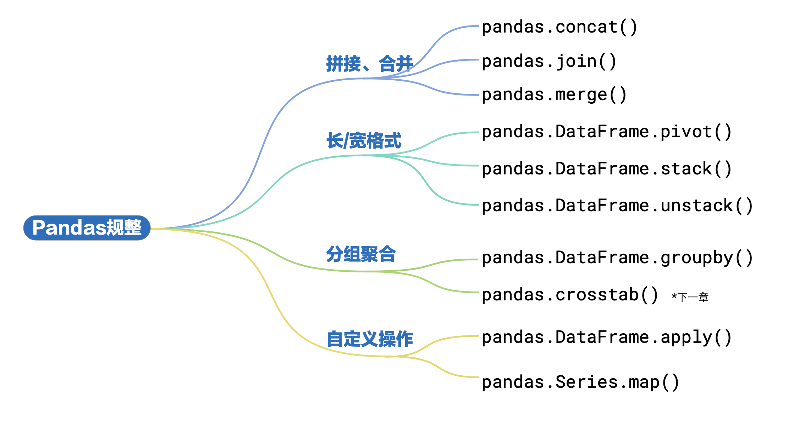

# Manipulating Pandas DataFrames

► 方法 `concat()` 将多个数据帧在特定轴方向进行拼接。  
► 方法 `join()` 将两个数据集按照索引或指定列进行合并。  
► 方法 `merge()` 按照指定的列标签或索引进行数据库风格的合并。

- 数据帧**重塑** (reshaping) 是指改变数据的行和列的排列方式。
- 数据帧**透视** (pivoting) 是指通过旋转数据的行和列，以重新排列数据，并根据指定的聚合函数来生成新的数据帧。
- 长格式 (long format): 长格式类似流水账，每一行代表一个观察值，比如某个学生某科目期中考试成绩
- 宽格式 (wide format): 宽格式更像是“矩阵”，每一行代表一个特定观察条件，比如某个特定学生的学号。此外，宽格式数据的列用于表示不同的特征或维度，比如特定一组科目。

► 方法 `pivot()` 用于根据一个或多个列创建一个新的数据透视表。`pivot_table()` 与 `pivot()` 类似，它也可以执行透视操作，但是它允许对重复的索引值进行聚合，产生一个透视表。它对于处 理有重复数据的情况更加适用。  
► 方法 `stack()` 用于将数据帧从宽格式转换为长格式。方法 `melt()` 也可以用于将数据从宽格式转换为长格式，类似于 `stack(`)。
► 方法 `unstack()` 是 `stack()` 的逆操作，用于将数据从长格式转换为宽格式，也就是将数据从索引转换为列。
