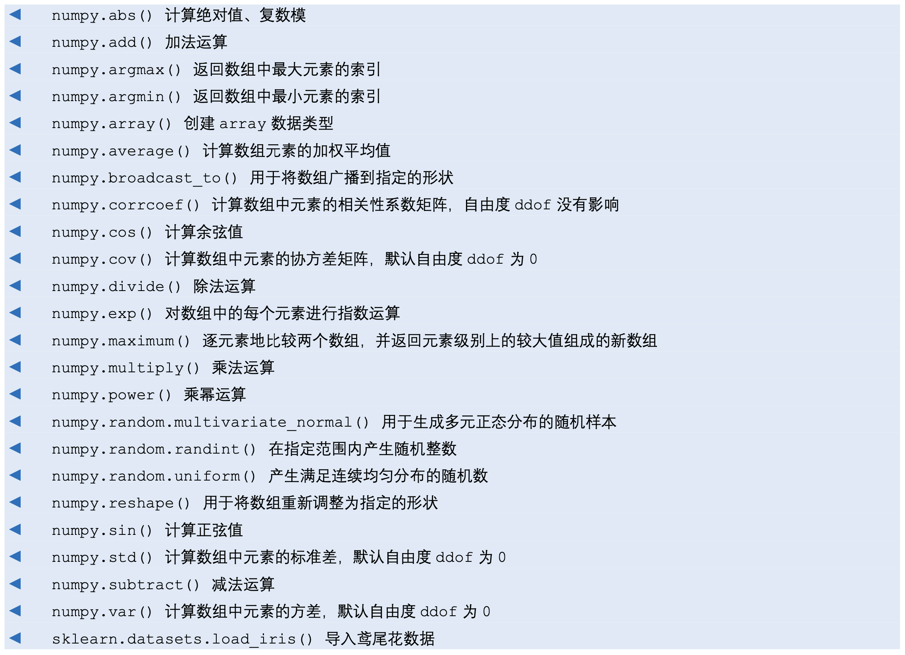

# API Quick Search

## Matplotlib

| api | desc |
| --- | ---- |
|     |      |

## Numpy

| api                       | desc                          |
| ------------------------- | ----------------------------- |
| `numpy.linalg.cholesky()` | 计算 Cholesky 分解            |
| `numpy.linalg.dot()`      | 计算向量的点积                |
| `numpy.linalg.eig()`      | 计算矩阵的特征值和特征向量    |
| `numpy.linalg.inv()`      | 计算矩阵的逆                  |
| `numpy.linalg.lstsq()`    | 求最小二乘解                  |
| `numpy.linalg.norm()`     | 计算向量的范数                |
| `numpy.linalg.pinv()`     | 计算矩阵的 Moore-Penrose 伪逆 |
| `numpy.linalg.solve()`    | 求解线性方程组                |
| `numpy.linalg.svd()`      | 计算奇异值分解                |

