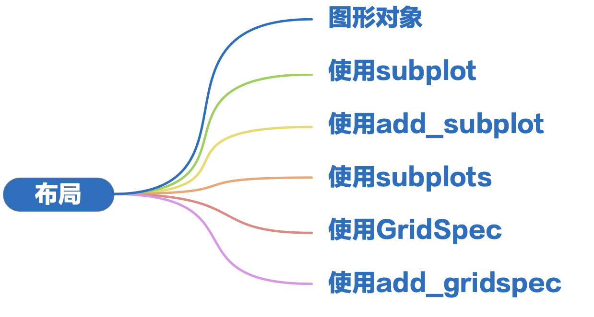
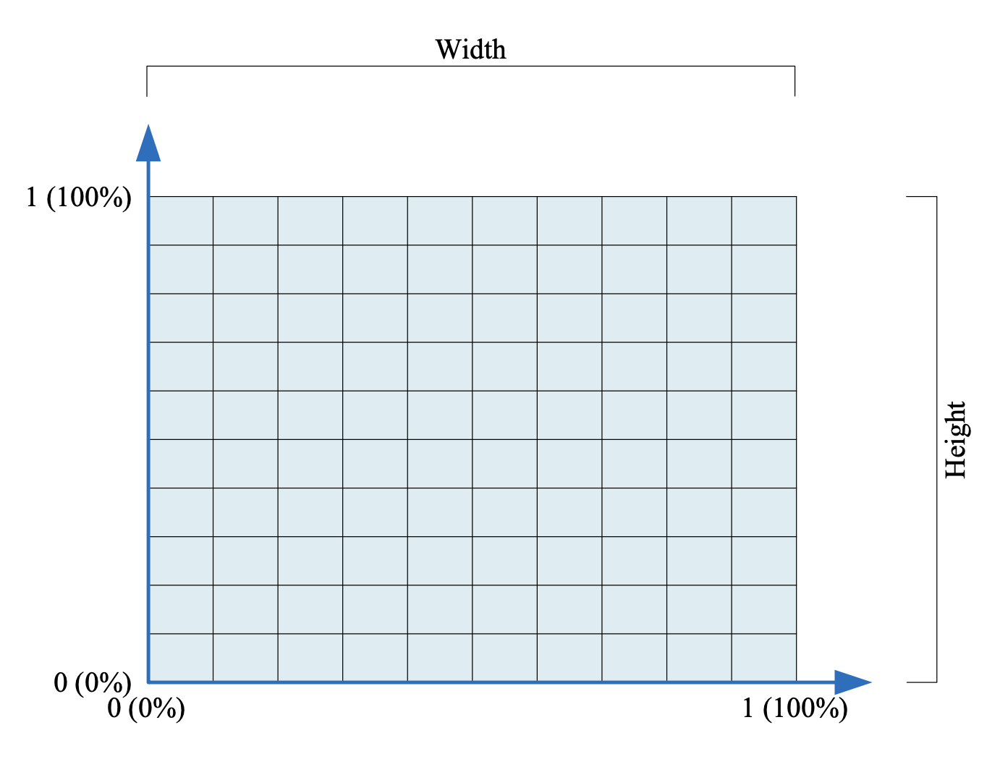

# Layout of A Figure



## 图形对象

- size
  - default: width 6.4 inches，height 4.8 inches
  - setting:
  ```python
  import matplotlib.pyplot as plt;
  plt.figure(figsize=(3, 3))
  ```
- dpi

  - default: 100
  - setting:

  ```python
  import matplotlib.pyplot as plt;
  plt.rcParams['figure.dpi'] = 300
  plt.savefig('plot_name.png', dpi=300)

  import seaborn as sns
  sns.set(rc={"figure.dpi": 300, "savefig.dpi": 300})
  ```

- margin
  - deafult:
  ```python
  figure.subplot.left = 0.125
  figure.subplot.right = 0.9
  figure.subplot.top = 0.88
  figure.subplot.bottom = 0.11
  ```
  

## 使用 subplot

- basic grammer
  ```python
  import matplotlib.pyplot.subplot as subplot
  plt(nrows, ncols, index)
  ```
- `plt.plot()` vs `ax.plot()`

## 使用 add_subplot

- basic grammer
  ```python
  import matplotlib.pyplot.subplot as plt
  fig = plt.figure()
  fig.add_subplot(nrows, ncols, index)
  ```
- `subplot()` vs `add_subplot()`
- `insert_axes()` vs `add_axes`

## 使用 subplots

- basic grammer

  ```python
  import matplotlib.pyplot.subplot as plt
  fig, axes = plt.subplots(nrows, ncols)
  ```

## 使用 GridSpec

## 使用 add_gridspec
