## 四大类算法:回归、分类、降维、聚类

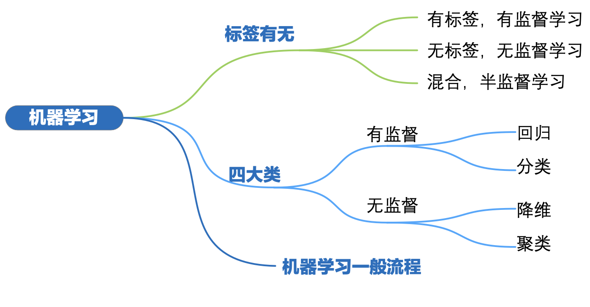

### 什么是机器学习?

#### 人工智能、机器学习、深度学习、自然语言处理

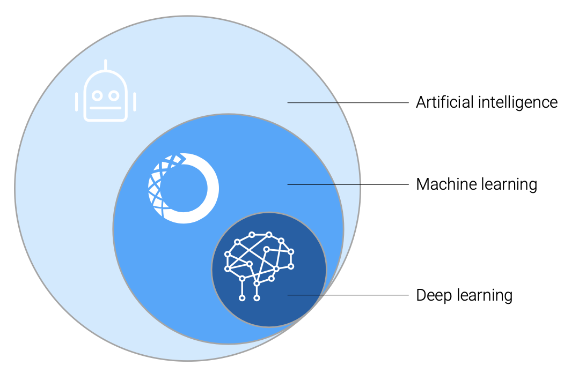

- 人工智能 (Artificial Intelligence，AI) 的外延十分宽泛，泛指指计算机系统通过模拟人的思维和行为，实现类似于人的智能行为。人工智能领域包含了很多技术和方法，如机器学习、深度 学习、自然语言处理、计算机视觉等。

- 机器学习 (Machine Learning，ML) 是人工智能的一个子领域，是通过计算机算法自动地从数
  据中学习规律，并用所学到的规律对新数据进行预测或者分类的过程。

  机器学习算法的特点是，从样本数据中分析并获得某种规律，再利用这个规律对未知数据进行预测。它是涉及概率、统计、矩阵论、代数学、优化方法、数值方法、算法学等多领域的交叉学科。

  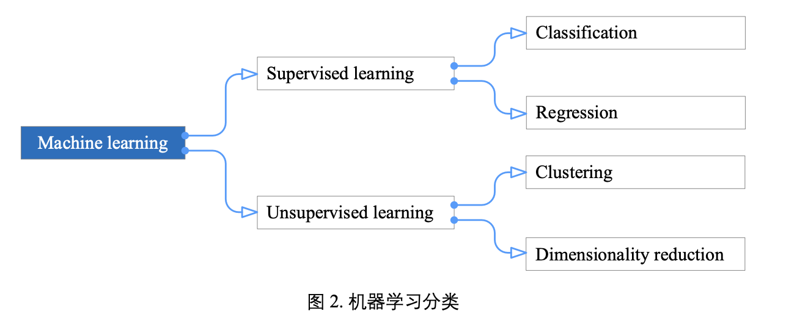

  机器学习适合处理的问题有如下特征:(a) **大数据**;(b) **黑箱或复杂系统**，难以找到控制方程 (governing equations)。机器学习需要通过数据的训练。

  如图 2 所示，简单来说，机器学习可以分为以下两大类:

  - 有监督学习 (supervised learning) 也叫监督学习，训练有标签值样本数据并得到模型，通过模型对新样本进行推断。
  - 无监督学习 (unsupervised learning) 训练没有标签值的数据，并发现样本数据的结构和分布。

  此外，半监督学习结合无监督学习和监督学习

- 深度学习 (Deep Learning, DL) 是一种机器学习的子领域，它是通过建立多层神经网络(neural network) 模型，自动地从原始数据中学习到更高级别的特征和表示，从而实现对复杂模式的建模和预测。

  Python 中常用的深度学习工具有 TensorFlow、PyTorch、Keras 等

- 自然语言处理 (Natural Language Processing, NLP) 是计算机科学与人工智能领域的一个重要分支，旨在通过计算机技术对人类语言进行分析、理解和生成。自然语言处理主要应用于自然语言文本的处理和分析，如文本分类、情感分析、信息抽取、机器翻译、问答系统等。

#### 有标签数据、无标签数据

根据输出值有无标签，如图 3 所示，数据可以分为有标签数据 (labelled data) 和无标签数据 (unlabelled data)。简单来说，有标签数据对应有监督学习 (supervised learning)，无标签数据对应无监督学习 (unsupervised learning)。
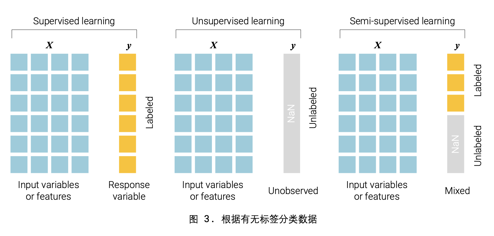

#### 四大类算法

有监督学习中，如果标签为连续数据，对应的问题为回归 (regression)，如图 4 (a)。如果标签为分类数据，对应的的问题则是分类 (classification)，如图 4 (c)。简单来说，分类问题与离散的输出相关，目标是将数据划分为不同的类别或标签，而回归问题与连续的输出相关，目标是预测 数值型数据的结果。

无监督学习中，样本数据没有标签。如果目标是寻找规律、简化数据，这类问题叫做降维 (dimensionality reduction)，比如主成分分析目的之一就是找到数据中占据主导地位的成分， 如图 4 (b)。如果模型的目标是根据数据特征将样本数据分成不同的组别，这种问题叫做聚类 (clustering)，如图 4 (d)。

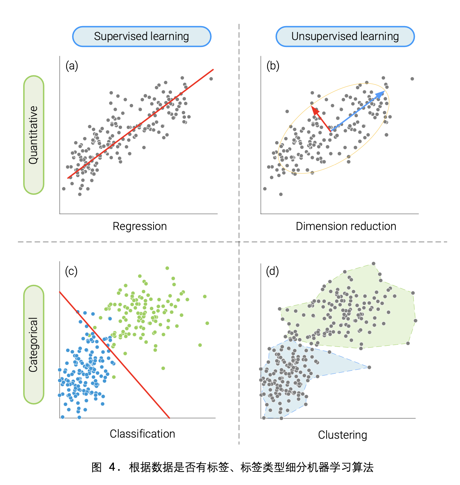

### 回归:找到自变量与因变量关系

回归问题是指根据已知的输入和输出数据，建立一个数学模型来预测输出值。给定一个输入，回归模型的目标是预测它的输出值，如房价预测、股票价格预测和天气预测等。

图 5 总结鸢尾花书系列丛书涉及的各种回归算法。
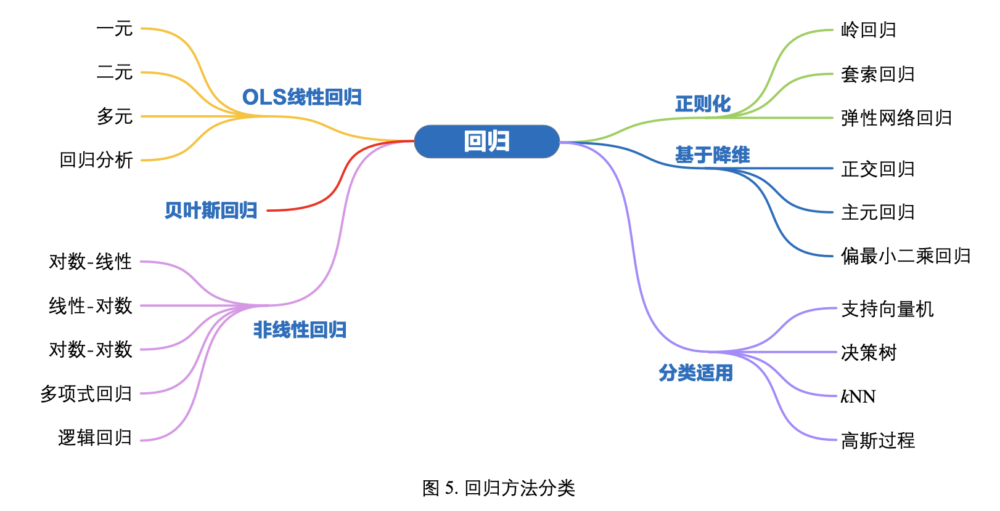

下面回顾回归算法中涉及的重要概念。

#### 最小二乘算法

线性回归 (linear regression) 通过构建一个线性模型来预测目标变量。最简单的线性回归算法是一元线性回归，多元线性回归则是利用多个特征来预测目标变量。线性回归离不开最小二乘法 (Ordinary Least Squares, OLS)。

首先，希望大家能够从多重视角理解 OLS 线性回归，比如优化 (图 6)、条件概率 (图 7)、几何 (图 8)、投影 (图 9)、数据、线性组合、SVD 分解、QR 分解、最大似然 MLE、最大后验 MAP 等视角。

此外，回归模型不能拿来就用，需要通过严格的回归分析。

#### 贝叶斯回归

贝叶斯回归 (Bayesian regression) 是一种基于贝叶斯定理的回归算法，它可以用来估计连续变量的概率分布。贝叶斯推断 (Bayesian inference) 把模型参数看作随机变量。根据主观经验和既有知识给出未知参数的概率分布，称为先验分布。从总体中得到样本数据后，根据贝叶斯定理，基于给定的 样本数据，得出模型参数的后验分布。

贝叶斯回归的优化问题对应最大后验 MAP。贝叶斯推断中，后验 ∝ 似然 × 先验，是最重要的关系，希望大家牢记。
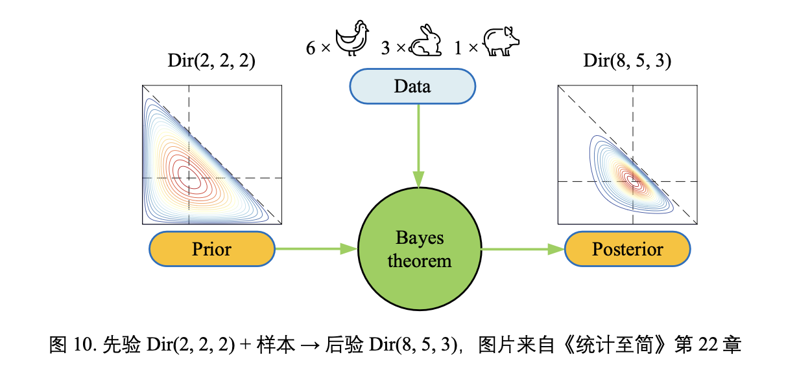

#### 非线性回归

非线性回归 (nonlinear regression) 目标变量与特征之间的关系不是线性的。多项式回归 (polynomial regression) 是非线性回归的一种形式，通过将特征的幂次作为新的特征来构建一个多项式模型。逻辑回归 (logistic regression) 既是一种二分类算法，可以用于非线性回归。

此外，大家会发现 k-NN、高斯过程算法完成的回归也都可以归类为非线性回归。

逻辑回归不但可以用来回归，也可以用来分类。

#### 正则化

正则化 (regularization) 正则化通过向目标函数中添加惩罚项来避免模型的过拟合。常用的正则化方法有岭回归、Lasso 回归、弹性网络回归。岭回归通过向目标函数中添加 L2 惩罚项来控制 模型复杂度。Lasso 回归通过向目标函数中添加 L1 惩罚项，它不仅能够控制模型复杂度，还可以进 行特征选择。弹性网络是岭回归和 Lasso 回归的结合体，它同时使用 L1 和 L2 惩罚项。

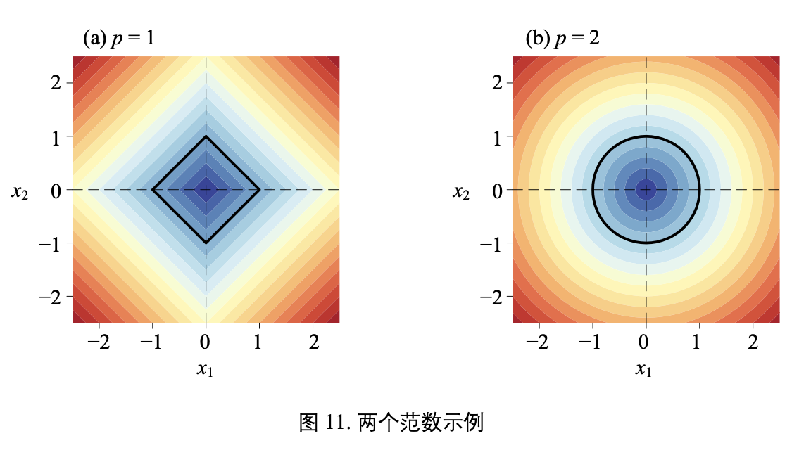

#### 基于降维算法的回归

特别介绍两种基于主成分分析的回归方法——正交回归、主元回归。

平面上，最小二乘法线性回归 OLS 仅考虑纵坐标方向上误差，如图 12 (a) 所示;而正交回归 TLS 同时考虑横纵两个方向误差，如图 12 (b) 所示。

主元回归的因变量则来自于主成分分析结果。
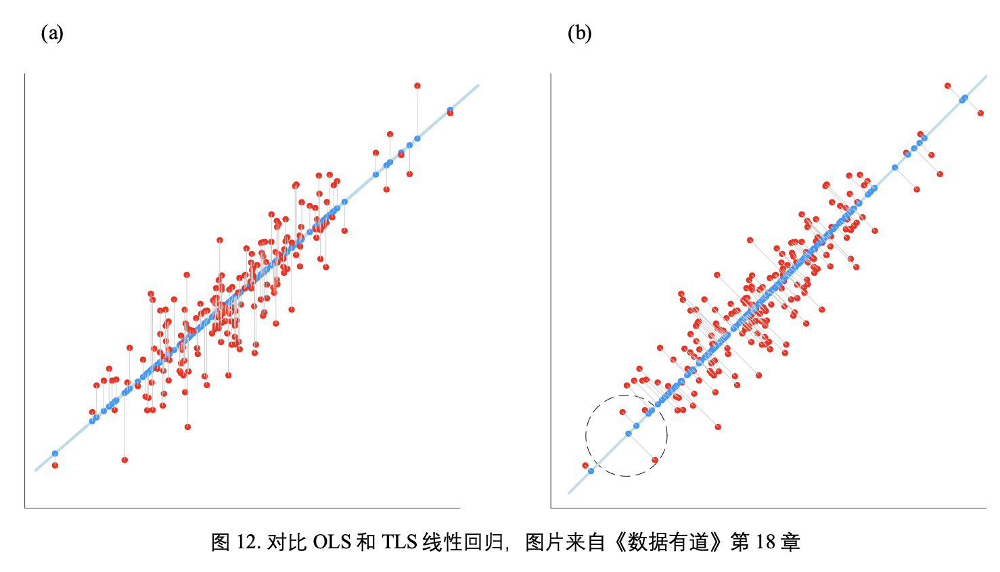

#### 基于分类算法的回归

实际上，监督学习的很多算法都兼顾分类、回归两项任务，比如逻辑回归、k-NN、支持向量机、高斯过程等等。kNN 算法是一种基于距离度量的分类算法，但也可以用于回归任务。支持向量回归 (Support Vector Regression, SVR) 则是一种基于支持向量机 (Support Vector Machine, SVM) 的回归算法。

### 分类:针对有标签数据

本书前文介绍过，分类 (classification) 是有监督学习 (supervised learning) 中的一类问题。分类是指根据给定的数据集，通过对样本数据的学习，建立分类模型来对新的数据进行分类 的过程。

分类问题是指将数据集划分为不同的类别或标签。给定一个输入，分类模型的目标是预测它所属的类别，如垃圾邮件分类、图像识别和情感分析等。分类问题的输出是一个离散值或类别标签。

如图 13 所示，大家已经清楚鸢尾花数据集分三类 (`setosa`、`versicolor`、`virginica`)。
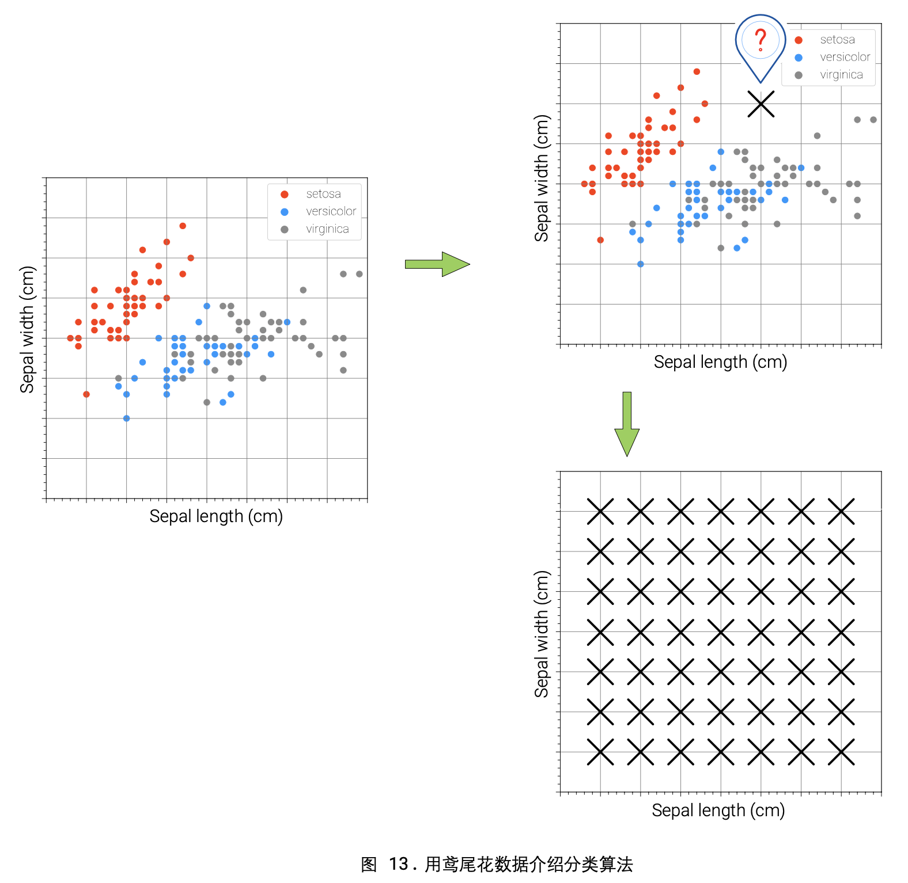

以花萼长度 (sepal length)、花萼宽度 (sepal width) 作为特征，大家如果采到一朵鸢尾花，测量后发现这朵花的花萼长度为 6.5 厘米，花瓣长度为 4.0 厘米，即图 13 中 ×，又叫查询点 (query point)。

根据已有数据，猜测这朵鸢尾花属于 `setosa` 、`versicolor` 、`virginica` 三类的哪一类可能性性更大，这就是分类问题。

决策边界 (decision boundary) 是分类模型在特征空间中划分不同类别的分界线或边界。通俗地说，决策边界就像是一道看不见的墙，把不同类别的数据点分隔开。

在简单的情况下，决策边界可能是一条直线;但在复杂的问题中，决策边界可能是一条弯曲的曲线，甚至是多维空间中的超平面。

模型训练过程就是调整模型的参数，使得决策边界能够最好地拟合训练数据，并且在未见过的数据上也能表现良好。

要注意的是，决策边界的好坏直接影响分类模型的性能。一个良好的决策边界能够很好地将数据分类，而一个不合适的决策边界可能导致模型预测错误。因此，选择合适的分类算法和调整模型参数是非常重要的，以获得有效的决策边界和准确的分类结果。

在机器学习中，分类是指根据给定的数据集，通过对样本数据的学习，建立分类模型来对新的数据进行分类的过程。下面简述一些常用的分类算法。

最近邻算法 (kNN):基于样本的特征向量之间的距离进行分类预测，即找到与待分类数据距离最近的 K 个样本，根据它们的类别进行投票决策。

朴素贝叶斯算法 (Naive Bayes):利用贝叶斯定理计算样本属于某个类别的概率，并根据概率大小进行分类决策。

支持向量机 (SVM):利用间隔最大化的思想来进行分类决策，可以通过核技巧 (kerel trick) 将低维空间中线性不可分的样本映射到高维空间进行分类。

决策树算法 (Decision Tree):通过对样本数据的特征进行划分，构建一个树形结构，从而实现对新数据的分类预测。

### 降维:降低数据维度，提取主要特征

降维 (dimensionality reduction) 是机器学习和数据分析领域中的重要概念，指的是将高维数据映射到低维空间中的过程。

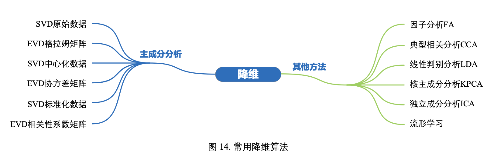

#### 主成分分析

主成分分析 (Principal Component Analysis, PCA) 通过线性变换将高维数据映射到低维空间。利用特征值分解、奇异值分解都可以完成主成分分析。

PCA 将原始数据的特征转换为新的特征，这些新特征按照重要性递减排列。通过选取前面的几个主成分，可以实现对数据的压缩和可视化。主成分分析常用于数据预处理、数据可视化和特征提取等领域。它能够剔除冗余的特征信息，简化数据模型，提高模型的效率和准确性，是机器学习中非常重要的技术之一。
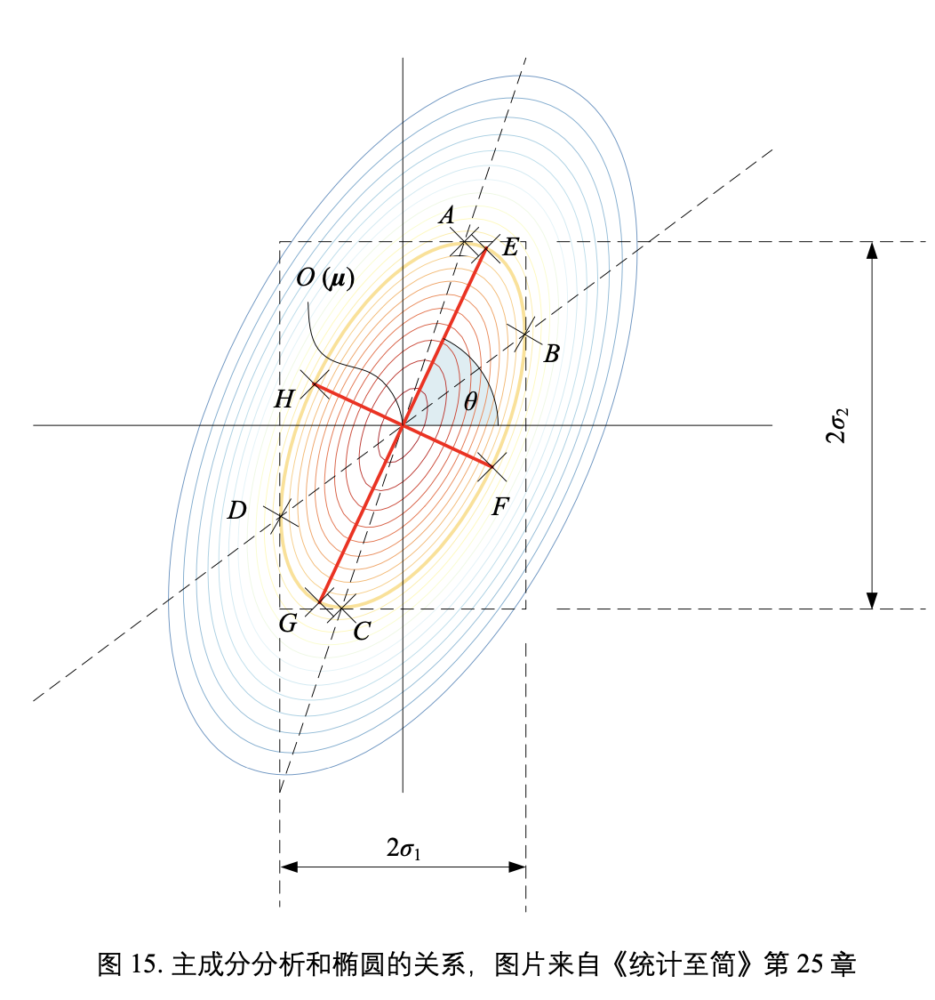
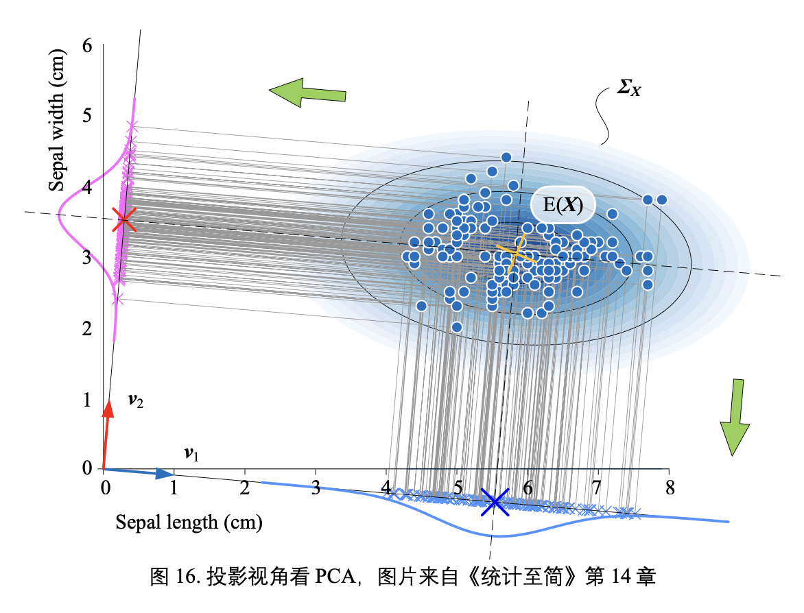

#### 增量 PCA

当 PCA 需要处理的数据矩阵过大，以至于内存无法支持，可以使用增量主成分分析 (Incremental PCA, IPCA) 替代主成分分析。IPCA 分批处理输入数据，以便节省内存使用。Scikit-learn 中专门做增量 PCA 的函数为 `sklearn.decomposition.IncrementalPCA()`。

#### 典型相关分析 CCA

典型相关分析也可以视作一种降维算法。典型相关分析是一种用于探究两组变量之间相关关系的统计方法，通常用于多个变量之间的关系分析。典型相关分析可以找出两组变量中最相关的线性组合，从而找到它们之间的相关性。典型相关分析的目的是提取出两组变量之间的共性信息，用于预测和解释数据。

#### 核主成分分析

核主成分分析 (Kernel PCA) 是一种非线性的主成分分析方法，它通过使用核技巧将高维数据映射到 低维空间中，从而提取出数据中的主要特征。与传统的 PCA 相比，Kernel PCA 可以更好地处理非线性 数据，更准确地保留数据中的非线性结构。

可以这样理解，PCA 是 Kernel PCA 的特列。PCA 中用到的格拉姆矩阵、协方差矩阵、相关性系数 矩阵都可以看成是不同线性核。

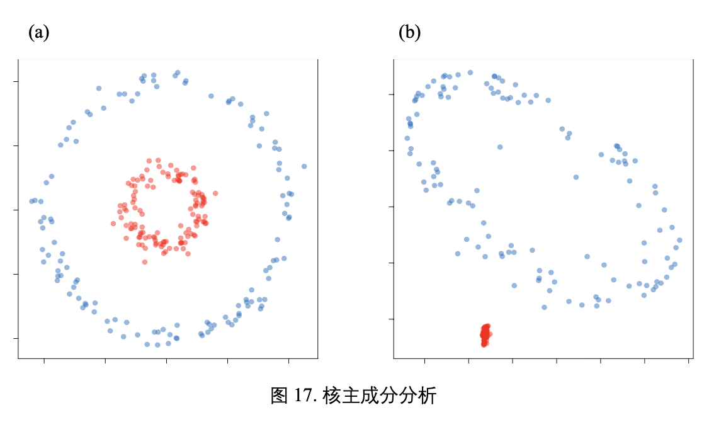

#### 独立成分分析

独立成分分析是一种用于从混合信号中恢复原始信号的数学方法。ICA 通过将混合信号映射到独立的成分空间中，从而恢复原始信号。独立成分分析将一个多元信号分解成独立性最强的可加子成分。因此，独立成分分析常用来分离叠加信号。

图 18 比较 PCA 和 ICA 对同一组数据的分解结果。与 PCA 不同的是，ICA 假设原始信号是独立的， 而 PCA 假设它们是正交关系。
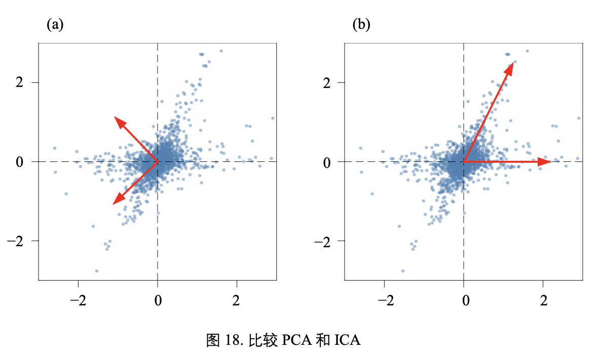

#### 流行学习

空间的数据可能是按照某种规则“卷曲”，度量点与点之间的“距离”要遵循这种卷曲的趋势。换一种思路，我们可以像展开“卷轴”一样，将数据展开并投影到一个平面上，得到的数据如图 20 所示。在图 20 所示平面上，A 和 B 两点的“欧氏距离”更好地描述了两点的距离度量，因为这个距离考虑了数据的“卷曲”。

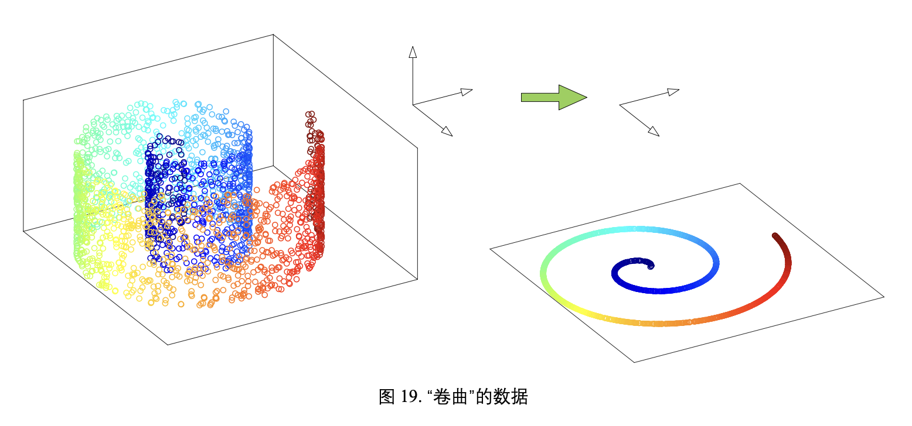
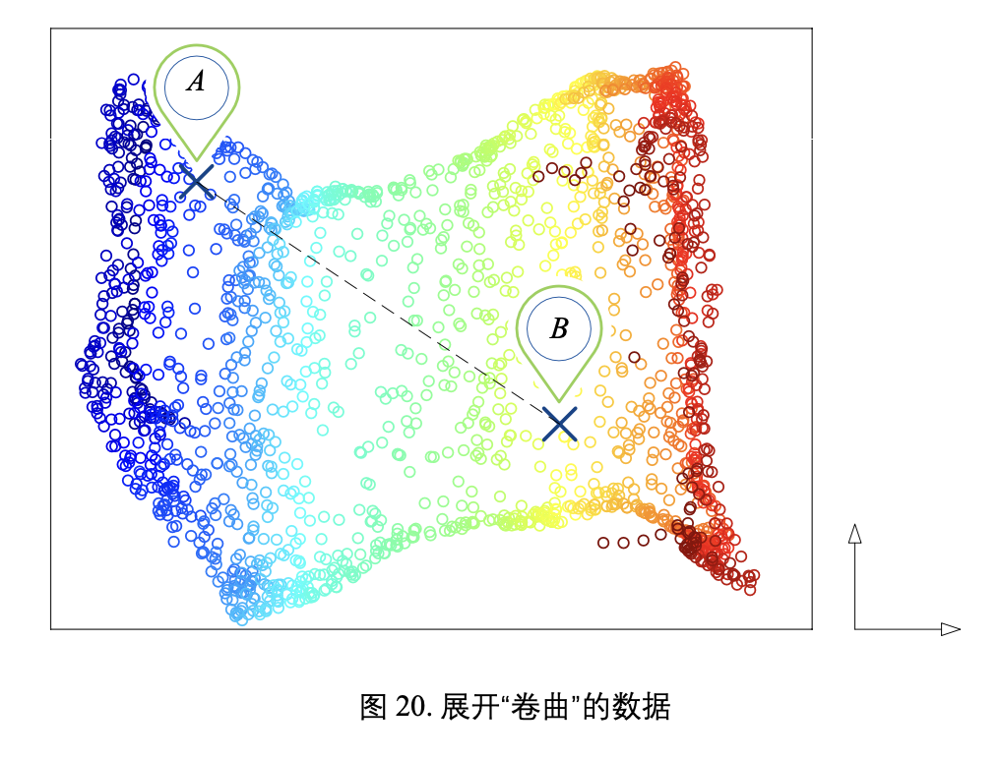

流形学习 (manifold learning) 核心思想类似图 19 和图 20 所示展开“卷轴”的思想。流形学习用于发现高维数据中的低维结构，也是非线性降维的一种方法。于 PCA 不同的是，流形学习可以更好地处理非线性数据和局部结构，具有更好的可视化效果和数据解释性。

### 聚类:针对无标签数据

简单来说，聚类是指将数据集中相似的数据分为一类的过程，以便更好地分析和理解数据。

在机器学习中，决定将数据分成多少个簇是一个重要而且有挑战性的问题，通常称为聚类数目的选择或者簇数选择。不同的聚类算法可能需要不同的方法来确定合适的聚类数目。

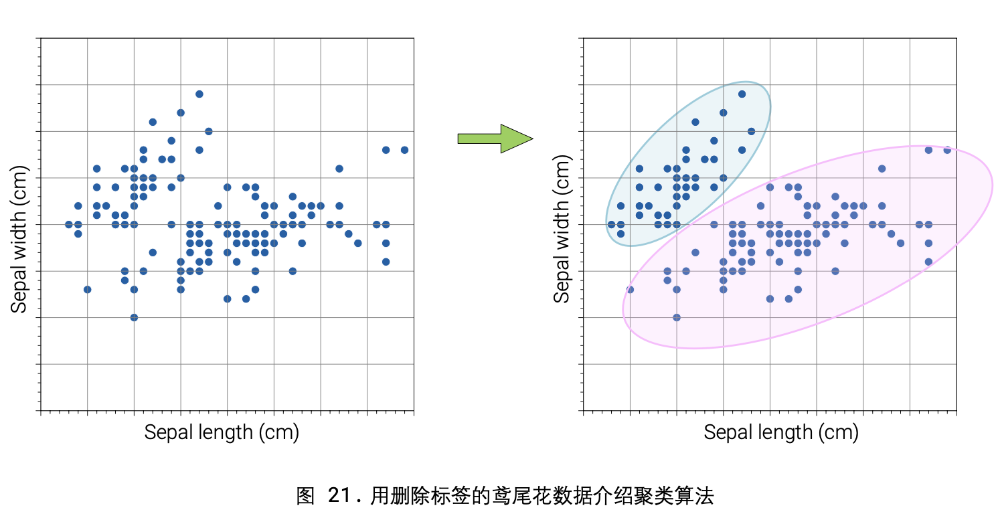

大家在使用 Scikit-Learn 聚类算法时，会发现有些算法有 predict() 方法。

也就是说，如图 22 所示，已经训练好的模型，有可能你将全新的数据点分配到确定的簇中。有这
种功能的聚类算法叫做归纳聚类 (inductive clustering)。

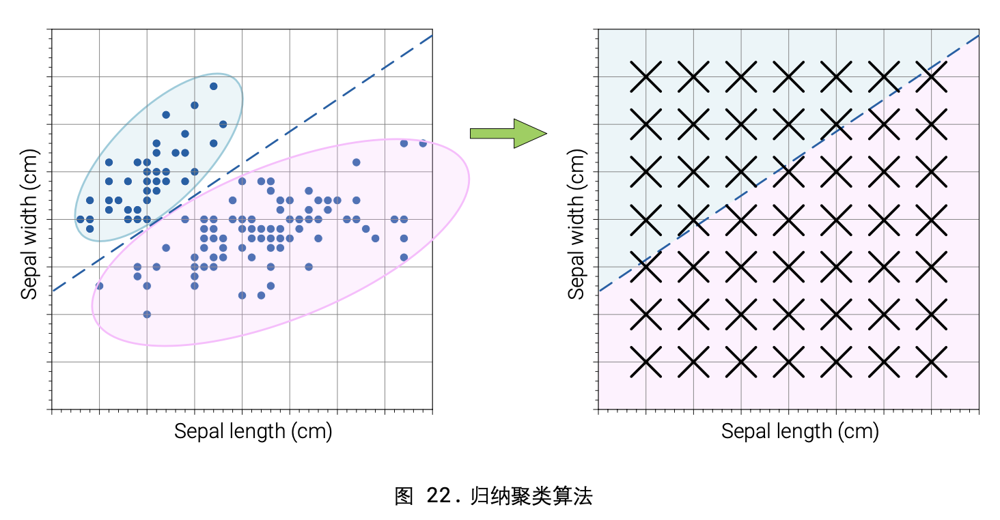

本章后文要介绍的 k 均值聚类、高斯混合模型都属于归纳聚类。如图 22 所示，归纳聚类算法也有决策边界。这就意味着归纳聚类模型具有一定的泛化能力，可以推广到新的、之前未见过的数据。不具备这种能力的聚类算法叫做非归纳聚类 (non-inductive clustering)。

非归纳聚类只能对训练数据进行聚类，而不能将新数据点添加到已有的模型中进行预测。这意味着模型在训练时只能学习训练数据的模式，无法用于对新数据点进行簇分配。比如，层次聚类、DBSCAN 聚类都是非归纳聚类。

归纳聚类强调模型的泛化能力，可以适应新数据，而非归纳聚类则更侧重于建模训练数据内部的结构。

k 均值算法 (kMeans):将样本分为 k 个簇，每个簇的中心点是该簇中所有样本点的平均值。

高斯混合模型 (Gaussian Mixture Model, GMM):将样本分为多个高斯分布，每个高斯分布 对应一个簇，采用 EM 算法进行迭代优化。

层次聚类算法 (Hierarchical Clustering) 将样本分为多个簇，可以使用自底向上的凝聚层 次聚类或自顶向下的分裂层次聚类。

DBSCAN (Density-Based Spatial Clustering of Applications with Noise) 是基于密度的聚类算法，可以自动发现任意形状的簇。

谱聚类算法 (Spectral Clustering) 是基于样本之间的相似度来构造拉普拉斯矩阵，然后对 其进行特征值分解来实现聚类。

### 机器学习流程

图 23 所示为机器学习的一般流程。具体分步流程通常包括以下步骤:

- 收集数据: 从数据源获取数据集，这可能包括数据清理、去除无效数据和处理缺失值等。
- 特征工程: 对数据进行预处理，包括数据转换、特征选择、特征提取和特征缩放等。
- 数据划分: 将数据集划分为训练集、验证集和测试集等。训练集用于训练模型，验证集用于选择模型并进行调参，测试集用于评估模型的性能。
- 选择模型: 选择合适的模型，例如线性回归、决策树、神经网络等。
- 训练模型: 使用训练集对模型进行训练，并对模型进行评估，可以使用交叉验证等方法进行模型选择和调优。
- 测试模型: 使用测试集评估模型的性能，并进行模型的调整和改进。
- 应用模型: 将模型应用到新数据中进行预测或分类等任务。
- 模型监控: 监控模型在实际应用中的性能，并进行调整和改进。

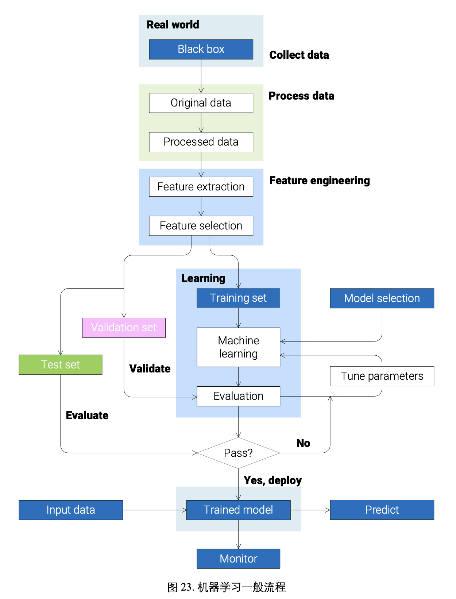

#### 特征工程

从原始数据中最大化提取可用信息的过程就叫做特征工程 (feature engineering)。特征很好理解，比如鸢尾花花萼长度宽度、花瓣长度宽度，人的性别、身体、体重等，都是特征。

特征工程是机器学习中非常重要的一个环节，指的是对原始数据进行特征提取、特征转换、特征选 择和特征创造等一系列操作，以便更好地利用数据进行建模和预测。

具体来说，特征工程包括以下方法。

- 特征提取 (Feature Extraction): 将原始数据转换为可用于机器学习算法的特征向量。注意，这个特征向量不是特征值分解中的特征向量。
- 特征转换 (Feature Transformation): 对原始特征进行数值变换，使其更符合算法的假设。例如，在回归问题中，可以对数据进行对数转换或指数转换等。
- 特征选择 (Feature Selection): 选择最具有代表性和影响力的特征。例如，可以使用相关性分析、PCA 等方法选择最相关或最重要的特征。
- 特征创造 (Feature Creation): 根据原始特征创造新的特征。例如，在房价预测问题中，可以根据房屋面积和房龄创建新的特征。
- 特征缩放 (Feature Scaling): 将特征缩放到相同的尺度或范围内，避免某些特征对模型训练的影响过大。例如，在神经网络中，可以使用标准化或归一化等方法对数据进行缩放。
