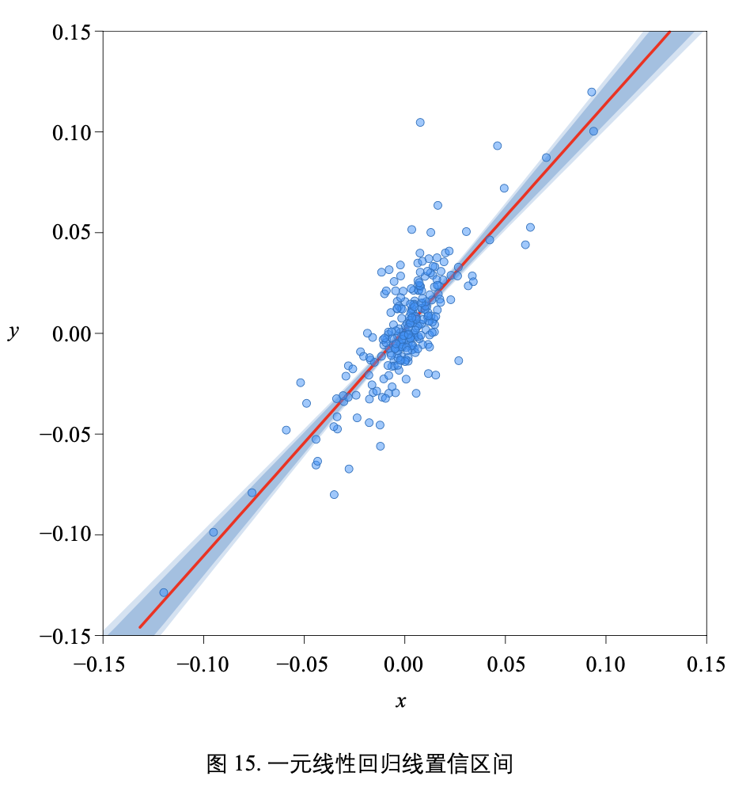
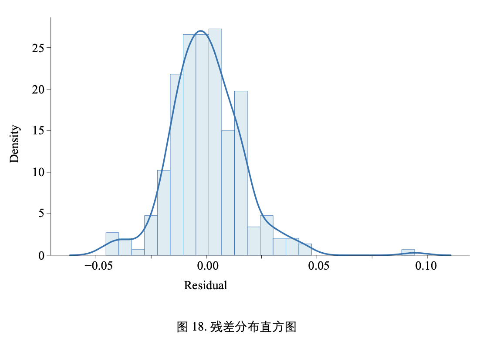

## Regression Analysis

### 线性回归:一个表格、一条直线

#### 一个表格

图 1 这个表格汇总某个线性回归分析的结果。本章的主要目的就是和大家理解这个表格各项数值的含义。下面首先介绍这个表格具体来自哪个线性回归。

#### 一条直线

图 2 所示为这个一元 OLS 线性回归的自变量、因变量散点数据以及分布特征。自变量为一段时间内标普 500 股票指数日收益率，因变量为某只特定股票的同期日收益率。观察散点图，我们可以发现明显的“线性”关系。

从金融角度，股指可以“解释”同一个市场上股票的涨跌。图 1 是利用 statsmodels.api.OLS() 函数构造的线性模型结果。

再次强调，线性回归不代表“因果关系”。

图 3 所示为用 seaborn.jointplot() 绘制回归图，并且绘制边际分布。

#### 统计特征

图 4 (a) 所示为数据的协方差矩阵。

《统计至简》第 12、24 章介绍过如何从条件概率角度理解线性回归。

《矩阵力量》第 23 章介绍过相关性系数可以看成是“标准差向量”之间夹角，具体如图 4 (c) 所示。

图 5 所示为两个标准差向量的箭头图。夹角越小，说明因变量向量 y 和自变量向量 x 越相近。也就是说，夹角越小，自变量向量 x 能更充分解释因变量向量 y。本章后文还会利用这个几何视角解释回归分析结果。

### 方差分析 ANOVA

ANOVA 的含义是方差分析 (Analysis of Variance)。方差分析是一种用于确定线性回归模型中不同变量对目标变量解释程度的统计技术。方差分析通过比较模型中不同的变量的平均方差，来确定哪些变量对目标变量的解释程度更高。

表 1 所示为标准 ANOVA 表格对应的统计量。标准 ANOVA 表格比图 6 多一行。表 1 有五列:

- 第 1 列为计算方差的三个来源;
- 第 2 列 df 代表自由度 (degrees of freedom);自由度是指在计算统计量时可以随意变化的独立数据点的数量。
- 第 3 列 SS 代表平方和 (Sum of Squares);平方和通常用于描述数据的变异程度，即它们偏离平均值 的程度。
- 第 4 列 MS 代表均方和 (Mean Sum of Squares);在统计学中，均方和是一种平均值的度量，其计算方法是将平方和除以自由度。
- 第 5 列 F 代表 F-test 统计量。F 检验是一种基于方差比较的统计检验方法，用于确定两个或多个样本之间是否存在显著性差异。

表中 n 代表参与回归的非 NaN 样本数量。k 代表回归模型参数数量，包括截距项。D 代表因变量的 数量，因此 k = D + 1 (+1 代表常数项参数)。

### 三个平方和

- 总离差平方和 (Sum of Squares for Total, SST)，也称 TSS (total sum of squares)。总离差平方和 SST 描述所有观测值与总体均值之间差异的平方和，用来评整个数据集的离散程度。
- 残差平方和 (Sum of Squares for Error, SSE)，也称 RSS (residual sum of squares)。残差平方和 SSE 反 映了因变量中无法通过自变量预测的部分，也称为误差项，可以用于检查回归模型的拟合程度和判断是否存在异常值。在回归分析中，常用通过最小化残差平方和来确定最佳的回归系数。
- 回归平方和 (Sum of Squares for Regression, SSR)，也称 ESS (explained sum of squares)。回归平方和 SSR 反映了回归模型所解释的数据变异量的大小，用于评估回归模型的拟合程度以及自变量对因变量的影响程度。

图 7 给出计算三个平方和所需的数值。表 2 总结了三个平方和的定义。

#### 等式关系

对于线性回归来说，方差分析实际上就是把 SST 分解成残差平方和 SSE、回归平方和 SSR:

$$
\begin{align}
SST = SSR + SSE
\end{align}
$$

即

$$
\begin{align}
\underbrace{\sum_{i=1}^n\left(y^{(i)} - \bar y\right)^2}_{SST} = \underbrace{\sum_{i=1}^n\left(\hat y^{(i)} - \bar y\right)^2}_{SSR} + \underbrace{\sum_{i=1}^n\left(y^{(i)} - \hat y^{(i)}\right)^2}_{SSE}
\end{align}
$$

### 总离差平方和 SST

总离差平方和 (Sum of Squares for Total, SST) 代表因变量 y 所有样本点与期望值 y 的差异:

$$
\begin{align}
SST = \sum_{i=1}^n\left(y^{(i)} - \bar y\right)^2
\end{align}
$$

其中，期望值 $\bar y$ 为:

$$
\begin{align}
\bar y = \frac{1}{n}\sum_{i=1}^n y^{(i)}
\end{align}
$$

如图 8 所示，SST 可以看做一系列正方形面积之和。这些正方形的边长为 $|y^{(i)} − \bar y|$ 。图 8 中这些正方 形的一条边都在期望值 $\bar y$ 这个高度上。

#### 总离差自由度 DFT

总离差自由度 (degree of freedom total, DFT) 的定义为:

$$
\begin{align}
DFT = n - 1
\end{align}
$$

$n$ 是样本数据的数量 (NaN 除外)。

#### 三个自由度关系

总离差自由度 DFT、回归自由度 DFR、残差自由度 DFE 三者关系为:

$$
\begin{align}
DFT = n - 1 = DFR + DFE = \underbrace{(k-1)}_{DFR} + \underbrace{(n-k)}_{DFE} = \underbrace{(D)}_{DFR} + \underbrace{(n - D - 1)}_{DFE}
\end{align}
$$

$k$ 是回归模型的参数，其中包括截距项。因此，

$$
\begin{align}
k = D + 1
\end{align}
$$

D 为参与回归模型的特征数，也就是因变量的数量。

举个例子，对于一元线性回归，D = 1，k = 2。如果参与建模的样本数据为 n = 252，几个自由度分别为:

$$
\begin{align}
\begin{cases}
DFT = 252 - 1 = 251 \\
k = D + 1 = 2 \\
DFR = k - 1 = D = 1 \\
DFE = n - k = n - D - 1 = 252 - 2 = 250
\end{cases}
\end{align}
$$

#### 平均总离差 MST

平均总离差 (mean square total, MST) 的定义为:

$$
\begin{align}
MST = var(Y) = \frac{\sum_{i=1}^n (y_i - \bar y)^2}{n-1} = \frac{SST}{DFT}
\end{align}
$$

实际上，平均总离差 MST 便是因变量 Y 样本数据方差。看到这里，大家应该理解为什么本章的内 容叫“方差分析”了。

### 回归平方和 SSR

回归平方和 (Sum of Squares for Regression, SSR) 代表回归方程计算得到的预测值 yˆ(i) 和期望值 y 之
间的差异:

$$
\begin{align}
SSR = \sum_{i=1}^n\left(\hat y^{(i)} - \bar y\right)^2
\end{align}
$$

图 9 所示为回归平方和 SSR 的几何意义。图 9 中的每个正方形边长为 yˆ(i) − y 。

#### 回归自由度 DFR

回归自由度 (degrees of freedom for regression model, DFR) 为:

$$
\begin{align}
DFR = k - 1 = D
\end{align}
$$

#### 平均回归平方 MSR

平均回归平方 (mean square regression, MSR) 为:

$$
\begin{align}
MSR = \frac{SSR}{DFR} = \frac{SSR}{k-1} = \frac{SSR}{D}
\end{align}
$$

### 残差平方和 SSE

残差平方和 (Sum of Squares for Error, SSE) 定义如下:

$$
\begin{align}
SSE = \sum_{i=1}^n\left (\epsilon^{(i)}\right )^2 = \sum_{i=1}^n\left (y^{(i)} - \hat y^{(i)}\right )^2
\end{align}
$$

图 10 所示为残差平方和 SSE 的示意图。图中每个正方形的边长为 y(i) − yˆ(i) 。对于 OLS 一元线性回 归，我们期待图中蓝色正方形面积之和最小。

#### 残差自由度 DFE

残差自由度 (degrees of freedom for error, DFE) 为:

$$
\begin{align}
DFE = n - k = n - D - 1
\end{align}
$$

#### 残差平均值 MSE

残差平均值 (mean squared error, MSE) 为:

$$
\begin{align}
MSE = \frac{SSE}{DFE} = \frac{SSE}{n - k} = \frac{SSE}{n - D - 1}
\end{align}
$$

#### 均方根残差 RMSE

均方根残差 (Root mean square error, RMSE) 为 MSE 的平方根:

$$
\begin{align}
RMSE = \sqrt{MSE} = \sqrt{\frac{SSE}{DFE}} = \sqrt{\frac{SSE}{n - p}} = \sqrt{\frac{SSE}{n - D - 1}}
\end{align}
$$

### 几何视角:勾股定理

#### 一个直角三角形

看到 (2) 中三个求和，我们下面用向量范数算式完成三个求和运算:

$$
\begin{equation}
\begin{aligned}
SST &= \sum_{i=1}^n\left(y^{(i)} - \bar y\right)^2 = ||y - \bar yI||^2_2 \\
SSR & = \sum_{i=1}^n\left(\hat y^{(i)} - \bar y\right)^2 = ||\hat y - \bar yI||^2_2 \\
SSE & = \sum_{i=1}^n\left(y^{(i)} - \hat y^{(i)}\right)^2 = ||y - \hat y||^2_2\\
\end{aligned}
\end{equation}
$$

根据 (2)，我们可以得到如下等式:

$$
\begin{align}
\underbrace{||y - \bar yI||^2_2}_{SST} = \underbrace{||\hat y - \bar yI||^2_2}_{SSR} + \underbrace{||y - \hat y||^2_2}_{SSE}
\end{align}
$$

相信大家一眼就会看出来，(18) 代表着直角三角形勾股定理!

如图 11 (a) 所示， $y - \bar yI$ 就是斜边对应的向量，斜边长度为 $||y - \bar yI||$ 。 $\hat y - \bar yI$ 为第一条直角边，
$\hat y - \bar yI$ 代表回归模型解释的部分。 $y - \hat y$ 为第二条直角边，代表残差项，也就是回归模型不能解释的部分。

图 11 中 $y - \bar yI$ 和 $\hat y - \bar yI$ 的起点为 $\bar yI$ 的终点，这相当于去均值。

如图 11 (b) 所示，这个勾股定理还可以写成:

$$
\begin{align}
(\sqrt{SST})^2 = (\sqrt{SSR})^2 + (\sqrt{SSE})^2
\end{align}
$$

#### 四个直角三角形

图 11 的直角三角形是图 12 这个四面体的一个面 (灰色底色)。而图 12 这个四面体的四个面都是直角三 角形!

### 拟合优度:评价拟合程度

如图 13 所示，向量 $y - \bar yI$ 和向量 $\hat y - \bar yI$ 之间夹角 θ 越小，说明误差越小，代表拟合效果越好。

在回归模型创建之后，很自然就要考虑这个模型是否能够很好地解释数据，即考察这条回归线对观察值的拟合程度，也就是所谓的拟合优度 (goodness of fit)。拟合优度是指一个统计模型与观测数据之间的拟合程度，即模型能够多好地解释数据。简单地说，拟合优度是回归分析中考察样本数据点对于回归线的贴合程度。

决定系数 (coefficient of determination，R2) 是定量化反映模型拟合优度的统计量。

从几何角度来看，$R^2$ 是图 12 中 θ 余弦值 $cosθ$ 的平方:

$$
\begin{align}
R^2 = cos(\theta)^2
\end{align}
$$

利用图 11 (b) 直角三角形三边之间的关系，R2 可以整理为:

$$
\begin{align}
R^2 = \frac{SSR}{SST} = 1 - \frac{SSE}{SST}
\end{align}
$$

当预测值越接近样本值，R2 越接近 1;相反，若拟合效果越差，R2 越接近 0。拟合优度可以帮助评估回归模型的可靠性和预测能力，并对模型进行改进和优化。

#### 一元线性回归

特别地，对于一元线性回归，决定系数是因变量与自变量的相关系数的平方，与模型系数 b1 也有直接关系。

$$
\begin{align}
R^2 = \rho^2_{X,Y} = \left(b_1\frac{\sigma_X}{\sigma_Y}\right)^2
\end{align}
$$

其中，

$$
\begin{align}
b_1= \rho_{X,Y}\frac{\sigma_Y}{\sigma_X}
\end{align}
$$

也就是说，在一元线性回归中，R2 的平方根等于线性相关系数的绝对值。也就是说，当 ρ 等于 1 或 −1 时，$R^2$ 为 1，表示因变量完全由自变量解释;当 ρ 等于 0 时，$R^2$ 为 0，表示自变量对因变量没有任何 解释能力。因此，$R^2$ 越接近 1，表示自变量对因变量的解释能力越强，线性相关系数 ρ 的绝对值也越 大，反之亦然。

#### 修正决定系数

但是，仅仅使用 R2 是不够的。对于多元线性模型，不断增加解释变量个数 D 时，R2 将不断增大。 我们可以利用修正决定系数 (adjusted R squared)。简单来说，修正决定系数考虑到自变量的数目对决定 系数的影响，避免了当自变量数量增加时决定系数的人为提高。修正决定系数的具体定义为:

$$
\begin{equation}
\begin{aligned}
R^2_{adj} &= 1 - \frac{MSE}{MST} \\
&= 1 - \frac{SSE / (n-k)}{SST/(n-1)} \\
&= 1 - \left(\frac{n-1}{n-k}\right)\frac{SSE}{SST} \\
&= 1 - \left(\frac{n-1}{n-k}\right)(1-R^2) \\
&= 1 - \left(\frac{n-1}{n- D - 1}\right)\frac{SSE}{SST} \\
\end{aligned}
\end{equation}
$$

修正决定系数的作用在于，当模型中自变量的数量增加时，它能够惩罚过拟合 (overfitting)，并避免 了决定系数因为自变量个数增加而提高的问题。因此，在比较不同模型的拟合优度时，使用修正决定系数会更加准确，能够更好地刻画模型的解释能力。

过拟合是指一个模型在训练数据上表现良好，但在测试数据上表现较差的现象。在过拟合的情况下，模型过度地学习了训练数据的特征和噪声，导致其在测试数据上的预测能力下降。

过拟合通常发生在模型复杂度过高或者训练数据太少的情况下。例如，在一元线性回归中，如果使用高次多项式来拟合数据，就容易出现过拟合的情况。在这种情况下，模型会过度拟合训练数据，导致其在新数据上的预测能力下降。

为了避免过拟合，可以采取以下方法:增加训练数据量、降低模型复杂度、采用正则化 (regularization) 技术等。

### F 检验:模型参数不全为 0

在线性回归中，F 检验用于检验线性回归模型参数是否显著。它通过比较回归平方和和残差平方和的大小来判断模型是否具有显著的解释能力。

#### 统计量

F 检验的统计量为:

$$
\begin{equation}
\begin{aligned}
F &= \frac{MSR}{MSE} = \frac{\frac{SSR}{k-1}}{\frac{SSE}{n-k}} = \frac{SSR(n-k)}{SSE(k-1)} \\
&= \frac{\frac{SSR}{D}}{\frac{SSE}{n-D-1}} = \frac{SSR \cdot (n-D-1)}{SSE \cdot D} \sim  F(k-1, n-k)
\end{aligned}
\end{equation}
$$

#### 原假设、备择假设

- 假设检验 (hypothesis testing) 是统计学中常用的一种方法，用于根据样本数据推断总体参数是否符合某种假设。假设检验通常包括两个假设:原假设和备择假设。
- 原假设 (null hypothesis) 是指在实验或调查中假设成立的一个假设，通常认为其成立。
- 备择假设 (alternative hypothesis) 是指当原假设不成立时，我们希望成立的另一个假设。

通过收集样本数据，并根据统计学原理计算出样本统计量的概率分布，我们可以计算出拒绝原假设的概率。如果这个概率小于预设的显著性水平 (比如 0.05)，就可以拒绝原假设，认为备择假设成立。反之，如果这个概率大于预设的显著性水平，就不能拒绝原假设。

$F$ 检验是单尾检验，原假设$H_0$、备择假设$H_1$分别为:

$$
\begin{equation}
\begin{aligned}
H_0 : b_1 =b_2 = ... = b_D = 0 \\
H_1: b_j \neq 0 \text{ for at least one j}
\end{aligned}
\end{equation}
$$

具体来说，F 检验的零假设是模型的所有回归系数都等于零，即自变量对因变量没有显著的影响。如果 F 检验的 p 值小于设定的显著性水平，就可以拒绝零假设，认为模型是显著的，即自变量对因变量 有显著的影响。

#### 临界值

(25) 得到的 F 值和临界值 Fα 进行比较。临界值 $F_α$ 可根据两个自由度 (k − 1 和 n − k) 以及显著性水平 α 查表获得。1 − α 为置信度或置信水平，通常取 α = 0.05 或 α = 0.01。这表明，当作出接受原假设的决 定时，其正确的可能性为 95%或 99%。
如果，

$$
\begin{align}
F > F_{1-\alpha}(k-1, n-k)
\end{align}
$$

在该置信水平上拒绝零假设 $H_0$，不认为自变量系数同时具备非显著性，即所有系数不太可能同时为零。 否则，接受$H_0$，自变量系数同时具有非显著性，即所有系数很可能同时为零。

#### 举个例子

给定条件 $α = 0.01，F_{1–α}(1, 250) = 6.7373$。图 6 结果告诉我们，F = 549.7 > 6.7373，表明可以显著地拒绝 $H_0$。

也可以用图 6 中 p 值，

$$
\begin{align}
p-value=P(F<F_{\alpha} (k−1,n−k))
\end{align}
$$

### t 检验:某个回归系数是否为 0

在线性回归中，t 检验主要用于检验线性回归模型中某个特定自变量的系数是否显著。具体地，t 检验的零假设是特定回归系数等于零，即自变量对因变量没有显著的影响。如果 t 检验的 p 值小于设定的 显著性水平，就可以拒绝零假设，认为该自变量的系数是显著不为零的，即自变量对因变量有显著的影响。
需要注意的是，t 检验一般用来检验一个特定自变量的系数是否显著，而不能判断模型整体是否显著。如果需要判断模型整体的显著性，可以使用前文介绍的 F 检验。

#### 原假设、备择假设

对于一元线性回归，t 检验原假设和备择假设分别为:

$$
\begin{equation}
\begin{aligned}
\begin{cases}
H_0 : b_1 = b_{1, 0} \\
H_1: b_1 \neq b_{1, 0}
\end{cases}
\end{aligned}
\end{equation}
$$

#### 统计量

$b_1$ 的 t 检验统计量:

$$
\begin{align}
t_{b1} = \frac{\hat b_1 - b_{1, 0}}{SE(\hat b_1)}
\end{align}
$$

$\hat b_1$为最小二乘法 OLS 线性回归估算得到的系数， $SE(\hat b_1)$为其标准误

$$
\begin{align}
SE(\hat b_1) = \sqrt{\frac{MSE}{\sum_{i=1}^n \left(x^{(i)} - \bar x\right)^2}} = \sqrt{\frac{\frac{\sum_{i=1}^n \left(\epsilon^{(i)}\right)^2}{n-2}}{\sum_{i=1}^n \left(x^{(i)} - \bar x\right)^2}}
\end{align}
$$

上式中，MSE 为本章前文介绍的残差平均值 (mean squared error)，n 是样本数据的数量 (除 NaN)。 标准误越大，回归系数的估计值越不可靠。

#### 临界值

如果下式成立，接受零假设 $H_0$:

$$
\begin{align}
-t_{1-\alpha/2, n-2} < T < t_{1-\alpha/2, n-2}
\end{align}
$$

否则，则拒绝零假设 $H_0$。

特别地，如果原假设和备择假设为:

$$
\begin{equation}
\begin{aligned}
\begin{cases}
H_0 : b_1 = 0 \\
H_1: b_1 \neq 0
\end{cases}
\end{aligned}
\end{equation}
$$

如果 (32) 成立，接受零假设$H_0$，即回归系数不具有显著统计性;白话说，也就是 $b_1 = 0$，意味着自 变量和因变量不存在线性关系。否则，则拒绝零假设$H_0$，即回归系数具有显著统计性。

#### 截距项系数

对于一元线性回归，对截距项系数 b0 的假设检验程序和上述类似。$b_0$ 的 t 检验统计值:

$$
\begin{align}
t_{b0} = \frac{\hat b_0 - b_{0,0}}{SE(\hat b_0)}
\end{align}
$$

$\hat b_0$为最小二乘法 OLS 线性回归估算得到的系数， $SE(\hat b_0)$为其标准误

$$
\begin{align}
SE(\hat b_0) = \sqrt{\frac{\sum_{i=1}^n \left(\epsilon^{(i)}\right)^2}{n-2}\left[\frac{1}{n} + \frac{\bar x^2}{\sum_{i=1}^n \left(x^{(i)} - \bar x\right)^2} \right]}
\end{align}
$$

#### 举个例子

t 检验统计值 T 服从自由度为 n – 2 的 t 分布。本节采用的 t 检验是双尾检测。在统计学中，双尾假设检验是指在假设检验过程中，假设被拒绝的区域位于一个统计量分布的两个尾端，即研究者对于一个参数或者统计量是否等于某一特定值，不确定其比该值大或小，而是存在两种可能性，因此需要在两个尾端进行检验。

比如给定显著性水平 α = 0.05 和自由度 n – 2 = 252 – 2 = 250，可以查表得到 t 值，即:

$$
\begin{align}
t_{1-\alpha/2, n-2} = t_{0.975, 250} = 1.969498
\end{align}
$$

Python 中，可以用 `stats.t.ppf(1 - alpha/2, DFE)` 计算上式两值。

由于学生 t-分布对称，所以:

$$
\begin{align}
t_{\alpha/2, n-2} = t_{0.025, 250} = −1.969498
\end{align}
$$

如图 1 所示，$t_{b1} = 23.446$，因此:

$$
\begin{align}
t_{b1} > t_{0.975, 250}
\end{align}
$$

### 置信区间:因变量均值的区间

### 预测区间:因变量特定值的区间

### 对数似然函数:用在最大似然估计 MLE

似然函数是一种关于统计模型中的参数的函数，表示模型参数中的似然性。

残差的定义为:

$$
\begin{align}
\epsilon^{(i)} = y^{(i)} - \hat y^{(i)}
\end{align}
$$

在 OLS 线性回归中，假设残差服从正态分布 N(0, σ2)，因此:

$$
\begin{align}
Pr(\epsilon^{(i)}) = \frac{1}{\sigma\sqrt{2\pi}}exp\left(-\frac{\left(y^{(i)} - \hat y^{(i)}\right)^2}{2\sigma^2} \right)
\end{align}
$$

似然函数为:

$$
\begin{align}

\end{align}
$$

### 信息准则:选择模型的标准

AIC 和 BIC 是线性回归模型选择中常用的信息准则，用于在多个模型中选择最优模型。

AIC 为赤池信息量准则 (Akaike information criterion, AIC)，定义如下:

$$
\begin{align}
AIC = 2k - 2ln(L)
\end{align}
$$

其中，k = D + 1;L 是似然函数。

AIC 鼓励数据拟合的优良性;但是，尽量避免出现过度拟合。(51) 中 2k 项为惩罚项 (penalty)。

贝叶斯信息准则 (Bayesian Information Criterion, BIC) 也称施瓦茨信息准则 (Schwarz information criterion, SIC)，定义如下

$$
\begin{align}
BIC = k \cdot ln(n) - 2ln(L)
\end{align}
$$

其中，n 为样本数据数量。BIC 的惩罚项比 AIC 大。

在使用 AIC 和 BIC 进行模型选择时，应该选择具有最小 AIC 或 BIC 值的模型。这意味着，较小的 AIC 或 BIC 值表示更好的模型拟合和更小的模型复杂度。

需要注意的是，AIC 和 BIC 都是用来选择模型的工具，但并不保证选择的模型就是最优模型。在实际应用中，应该将 AIC 和 BIC 作为指导，结合领域知识和经验来选择最优模型。同时，还需要对模型的假设和限制进行检验，以确保模型的可靠性和实用性。

### 残差分析:假设残差服从均值为 0 正态分布

残差分析 (residual analysis) 通过残差所提供的信息，对回归模型进行评估，分析数据是否存在可能 的干扰。残差分析的基本思想是，如果回归模型能够很好地拟合数据，那么残差应该是随机分布的，没 有明显的模式或趋势。因此，对残差的分布进行检查可以提供关于模型拟合优度的信息。

残差分析通常包括以下步骤:

- 绘制残差图。残差图是观测值的残差与预测值之间的散点图。如果残差呈现出随机分布、没有明显 的模式或趋势，那么模型可能具有较好的拟合优度。
- 检查残差分布。通过绘制残差直方图或核密度图来检查残差分布是否呈现出正态分布或近似正态分 布。如果残差分布不是正态分布，那么可能需要采取转换或其他措施来改善模型的拟合。
- 检查残差对自变量的函数形式。通过绘制残差与自变量之间的散点图或回归曲线，来检查残差是否 随自变量的变化而呈现出系统性变化。如果存在这种关系，那么可能需要考虑增加自变量、采取变 量转换等方法来改善模型的拟合。

图 17 所示为残差的散点图。图 18 所示为残差分布的直方图。理想情况下，我们希望残差为均值为 0 的正态分布。为了检测残差的正态性，本节利用 Omnibus 正态检验。

Omnibus 正态检验 (Omnibus test for normality) 用于检验线性回归中残差是否服从正态分布。 Omnibus 正态检验利用残差的偏度 S 和峰度 K，检验残差分布为正态分布的原假设。Omnibus 正态检验 的统计值为偏度平方、超值峰度平方两者之和。Omnibus 正态检验利用 χ2 检验 (Chi-squared test)。

### 自相关检测:Durbin-Watson

Durbin-Watson 用于检验序列的自相关。在线性回归中，自相关 (autocorrelation) 用来分析模型中的残差与其在时间上的延迟版本之间的相关性。当模型中存在自相关时，它可能表明模型中遗漏了某些重要的变量，或者模型中的时间序列数据未被正确处理。

自相关可以通过检查残差图来诊断。如果残差图表现出明显的模式，例如残差值之间存在周期性关系或呈现出聚集在某个区域的情况，那么就可能存在自相关。在这种情况下，可以通过引入更多的自变量或使用时间序列分析方法来修正模型。图 19 所示为残差的自相关图。

Durbin-Watson 检测的统计量为:

$$
\begin{align}
DW = \frac{\sum_{i=1}^n((y^{(i)} - \hat y^{(i)}) - (y^{(i-1)} - \hat y^{(i-1)}))^2}{\sum_{i=1}^n\left(y^{(i)} - \hat y^{(i)}\right)^2}
\end{align}
$$

上式本质上检测残差序列与残差的滞后一期序列之间的差异大小。DW 值的取值区间为 0 ~ 4。当 DW 值很小时 (DW < 1)，表明序列可能存在正自相关。当 DW 值很大时 (DW > 3) 表明序列可能存在负自相关。当 DW 值在 2 附近时 (1.5 < DW < 2.5)，表明序列无自相关。其余的取值区间表明无法确定序列是否存在自相关。

### 条件数:多重共线性

在线性回归中，条件数 (condition number) 常用来检验设计矩阵 $\mathbf X_{k×k}$ 是否存在多重共线性(multicollinearity)。

多重共线性是指在多元回归模型中，独立变量之间存在高度相关或线性关系的情况。多重共线性会导致回归系数的估计不稳定，使得模型的解释能力降低，甚至导致模型的预测精度下降。

对 $\mathbf X^T\mathbf X$ 进行特征值分解，得到最大特征值 $λ_{max}$ 和最小特征值 $λ_{min}$。条件数的定义为两者的比值的平方根:

$$
\begin{align}
condition \text{ } number = \sqrt{\frac{λ_{max}}{λ_{min}}}
\end{align}
$$

线性回归是一种用于研究自变量与因变量之间关系的统计模型。方差分析可以评估模型的整体拟合优度，其中的 F 检验可以用来线性模型参数整体显著性，t 检验可以评估单个系数的显著性。拟合优度指模型能够解释数据变异的比例，常用 R2 来度量。AIC 和 BIC 用于模型选择，可以在模型拟合度相似的情况下，选出最简单和最有解释力的模型。自相关指误差项之间的相关性，可以使用 Durbin-Watson 检验进行检测。条件数是用于评估多重共线性的指标，如果条件数过大，可能存在严重的多重共线性问题。
